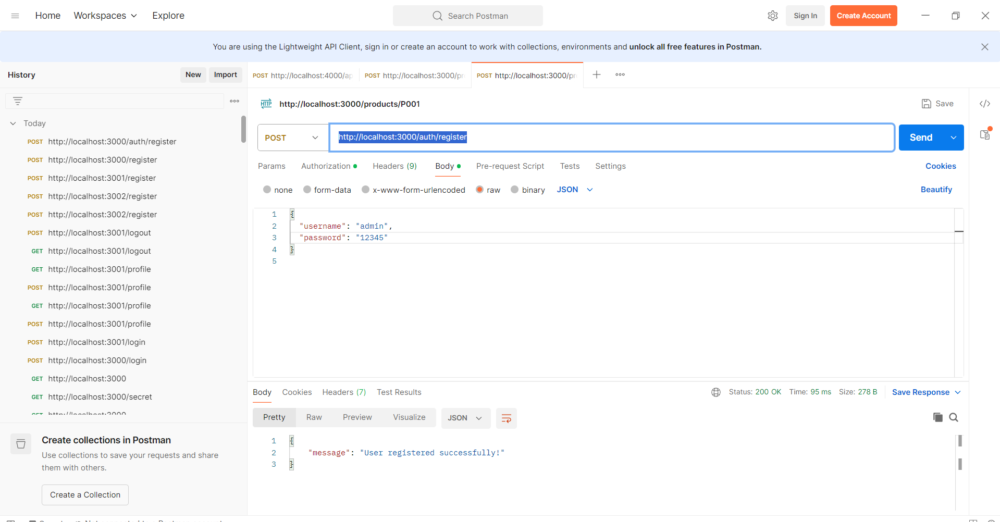
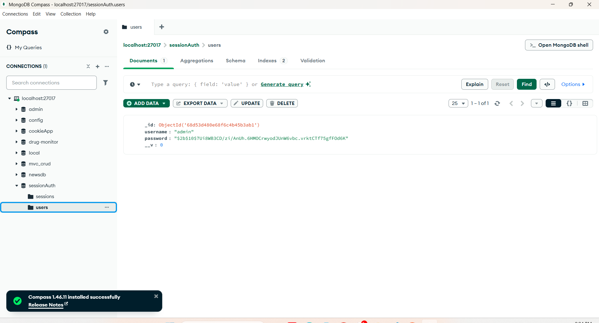
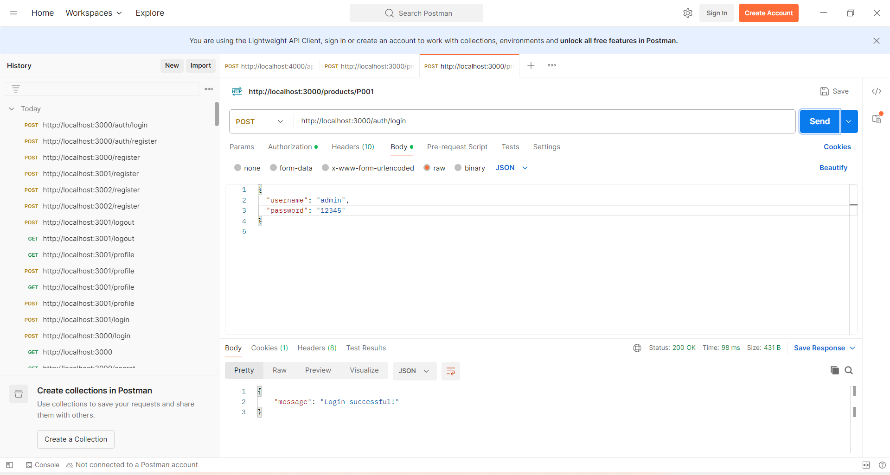
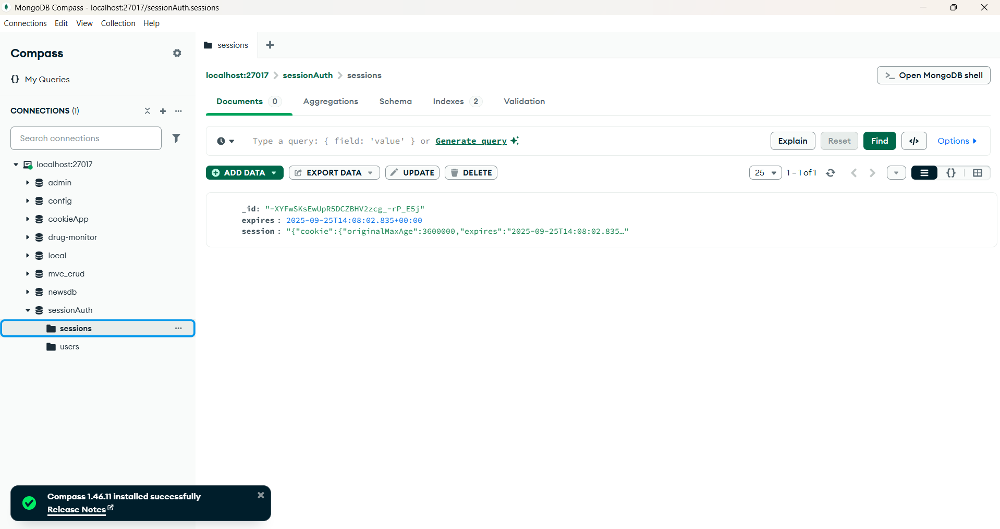
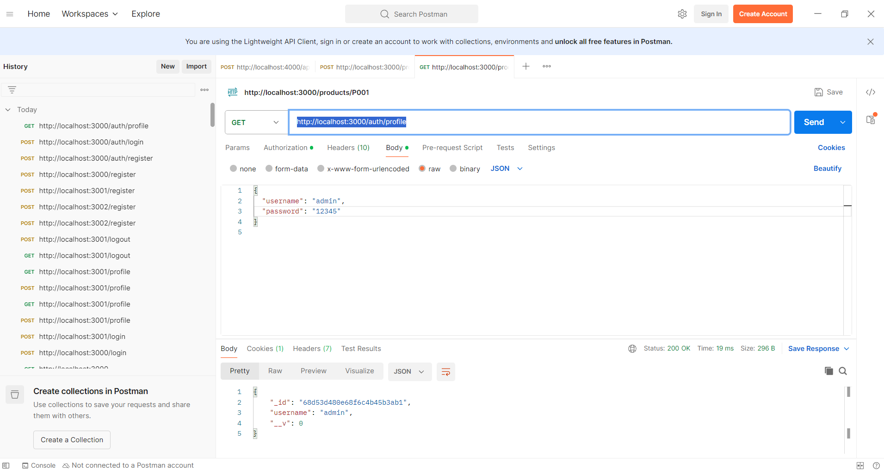
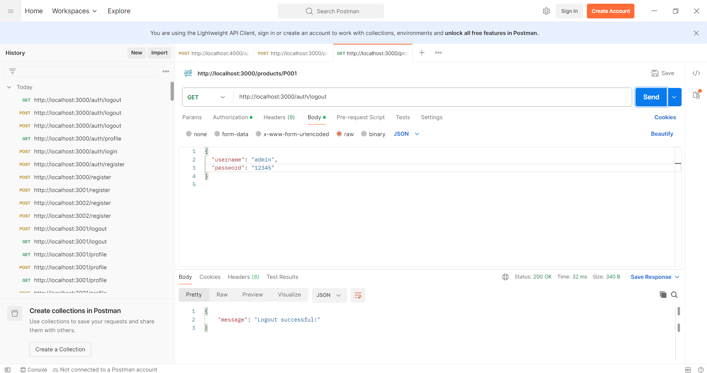
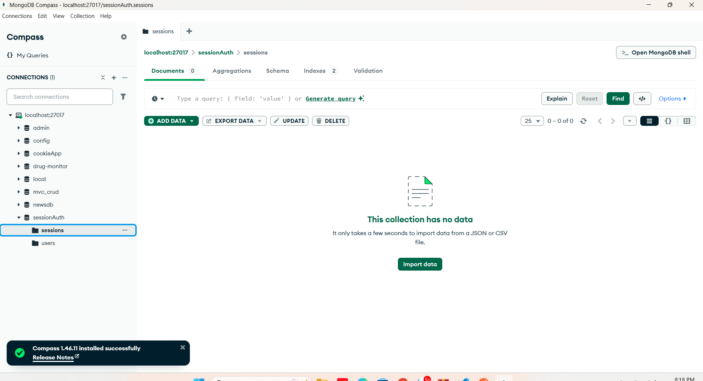

## Cookie-Session

22664681 - Nguyễn Vũ Thị Quế Trân

npm install
npm init -y
npm install express
npm install cookie-parser
npm install express-session
npm install mongoose

2. cookie_session_auth source code
a. cookie_session_auth
node app.js

b. register
Method: POST
URL: http://localhost:3000/auth/register

## Check in database

c.login
Method: POST
URL: http://localhost:3000/auth/login

## Check in database

d. go to profile
Method: GET
URL: http://localhost:3000/auth/profile

e. Logout
Method: GET
URL: http://localhost:3000/auth/logout

## Check in database
